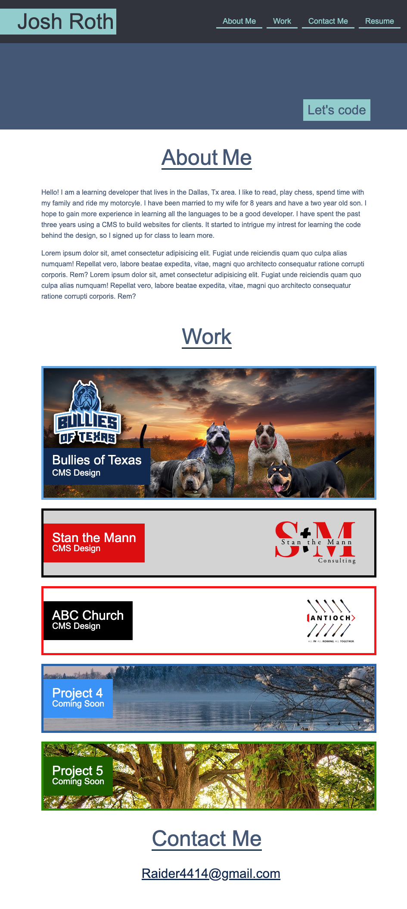

# Module-2-Challenge

## Description

This is a project that aims to make a portfolio that is responsive to show off my projects

## Installation

N/A

## Usage

Show a collection of projects

## Deployment
https://joshrthedeveloper.github.io/Module-2/
#### Screenshot

.

## Credits

[Pixaby for stock photos](https://pixabay.com)

## License

Please refer to the MIT LICENSE in the repo.
